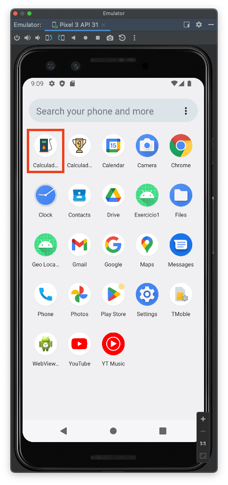
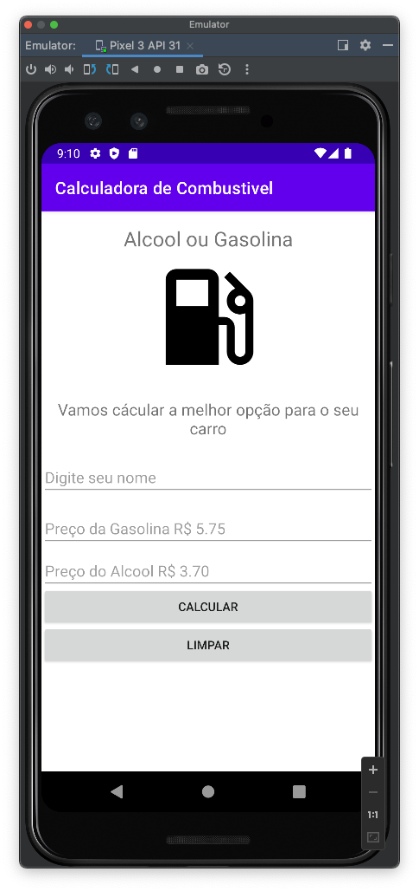
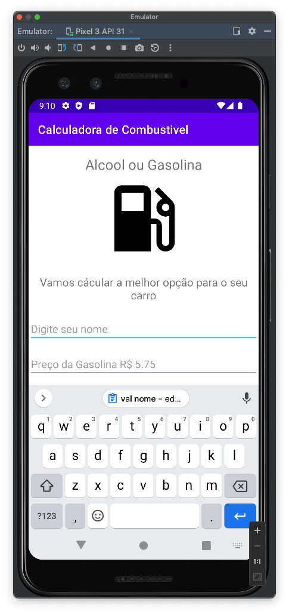
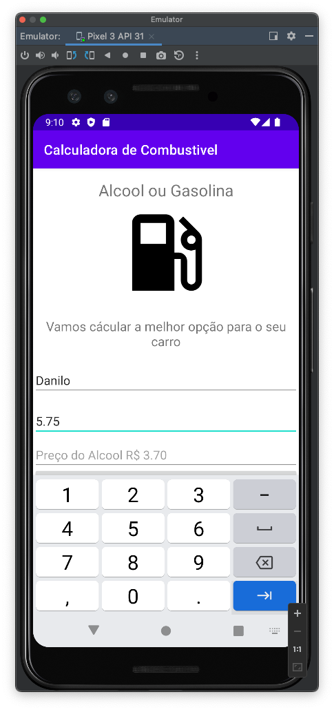
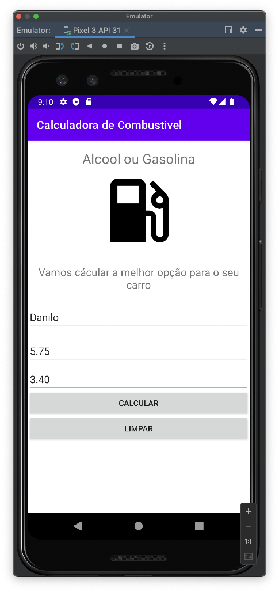
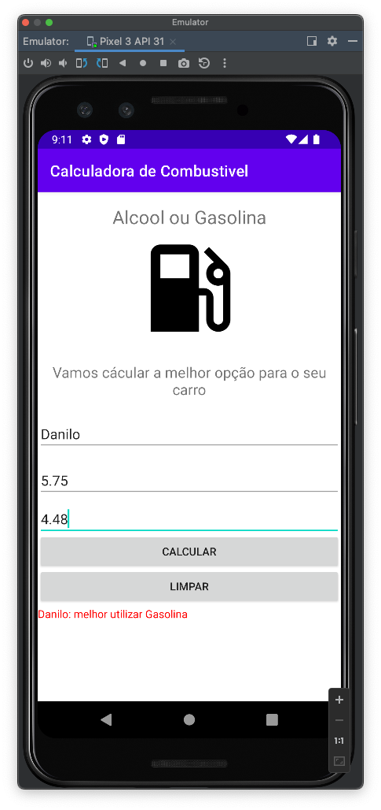

# mob-25-aplicacoes-android-aula3-gasolina

# Gasolina ou álcool?
VersionCode: 1.0

VersionName: "1"

# Introdução
Vamos construir um aplicativo que tem como objetivo informar o usuário qual combustível é mais indicado colocar no seu automovel, se álcool ou gasolina.

Com uma grande variação de preços encontrados no postos de gasolina e essa preocupação se torna cada vez mais relevantes.

Para isso vamos fazer um cálculo para informar o usuário qual combustível está com o melhor preço
## Cálculo 
O cálculo básico para se descobrir se o álcool é vantajoso ou não em relação à gasolina é simples. Basta dividir o preço do litro do álcool pelo da gasolina. Se o resultado for inferior a 0,7, use álcool. Se for maior que 0,7, então a gasolina é melhor.

| Telas     | Telas    |  
| ------------- | ------------- |
|||
|||
|||
||x|
# Authors
Danilo Santos
[@danilopsnts](https://www.linkedin.com/in/danilopsnts/)